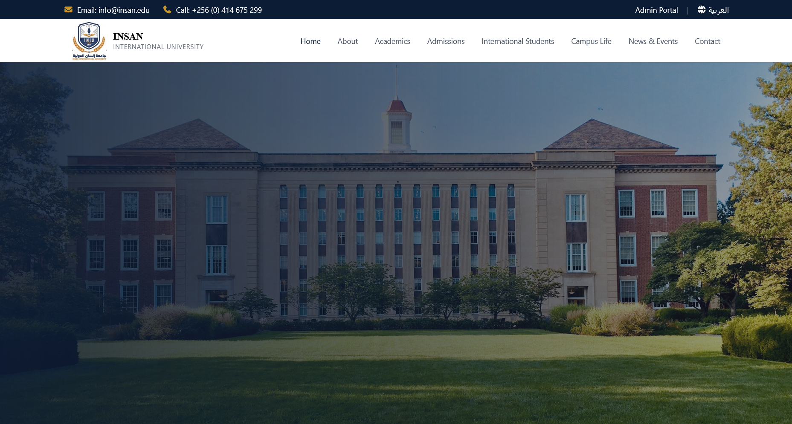
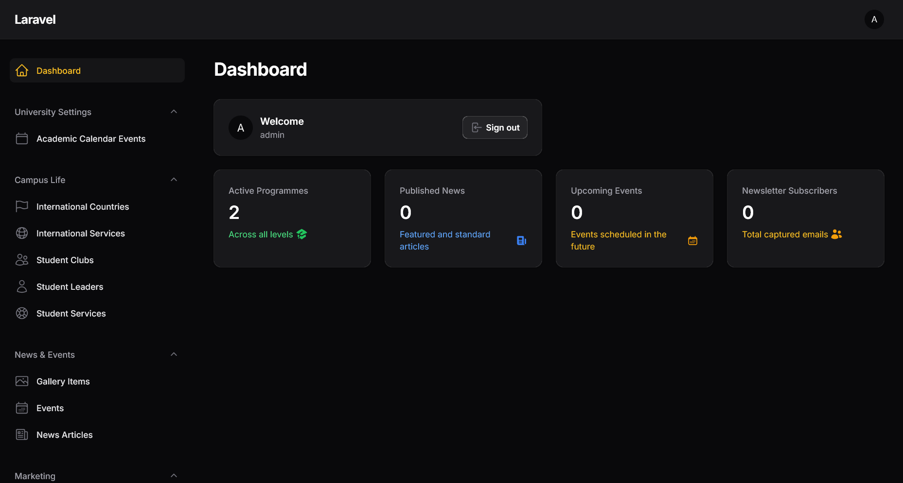
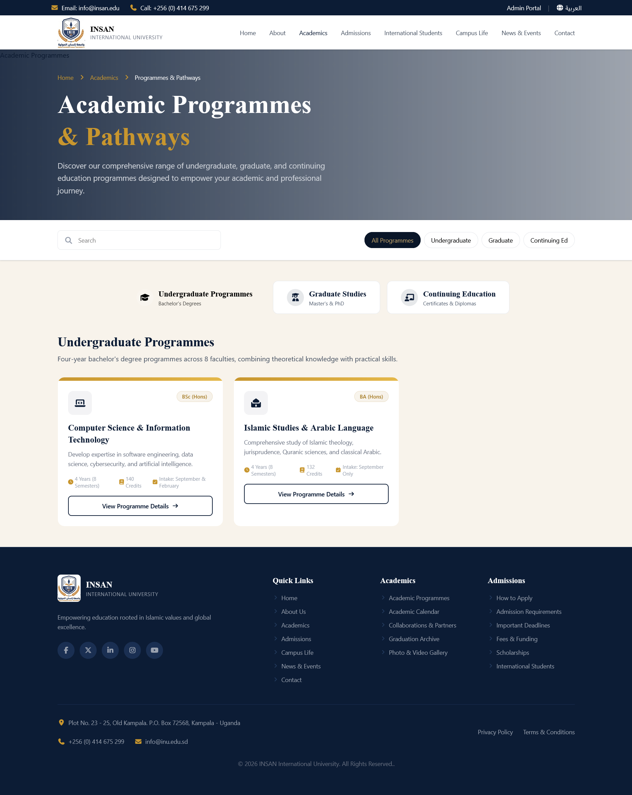
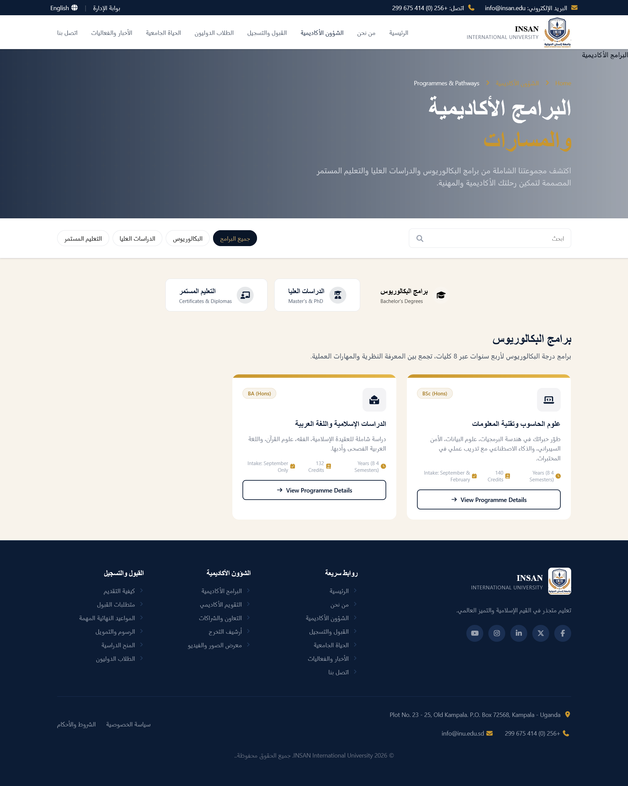

<div align="center">
  

  # INSAN International University Portal

  A modern, bilingual, and fully dynamic university web portal and administration system built for academic excellence and seamless content management.

  
  
  
  

</div>

---

## ✨ Features

- **🌐 Native Bilingual Support:** Full English (LTR) and Arabic (RTL) content delivery via Spatie Translatable.
- **🛡️ Powerful Admin Dashboard:** Built with FilamentPHP. Allows non-technical staff to manage Programmes, News, Events, Scholarships, and Fees with zero coding.
- **🎨 Modern UI/UX:** Responsive frontend built with Tailwind CSS v4, featuring a dynamic, auto-sliding hero carousel powered by live news articles.
- **📱 Mobile Optimized:** Flawless experience across desktops, tablets, and smartphones.
- **🗄️ JSON Array Handling:** Clean UI for managing complex data structures like fee modules and academic requirements.

---

## 📸 Screenshots

| Homepage (Dynamic Hero) | Admin Dashboard (Filament) |
| :---: | :---: |
|  |  |
| **Academic Programmes** | **Bilingual Content Editing** |
|  |  |

---

## 🚀 Quick Start (Local Development)

Follow these steps to get the project running on your local machine.

### 1. Clone the repository
```bash
git clone https://github.com/yourusername/insan-university.git
cd insan-university