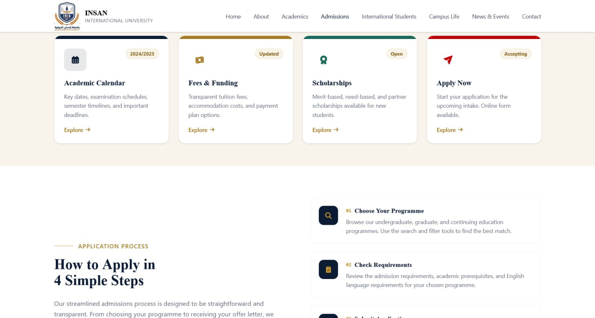

<div align="center">
  

# INSAN International University Portal

A modern, bilingual, and fully dynamic university web portal and administration system built for academic excellence and seamless content management.


</div>

---

## ✨ Features

-   **🌐 Native Bilingual Support:** Full English (LTR) and Arabic (RTL) content delivery via Spatie Translatable.
-   **🛡️ Powerful Admin Dashboard:** Built with FilamentPHP. Allows non-technical staff to manage Programmes, News, Events, Scholarships, and Fees with zero coding.
-   **🎨 Modern UI/UX:** Responsive frontend built with Tailwind CSS v4, featuring a dynamic, auto-sliding hero carousel powered by live news articles.
-   **📱 Mobile Optimized:** Flawless experience across desktops, tablets, and smartphones.
-   **🗄️ JSON Array Handling:** Clean UI for managing complex data structures like fee modules and academic requirements.

---

## 📸 Screenshots

|                           Homepage (Dynamic Hero)                           |                          Admin Dashboard (Filament)                          |
| :-------------------------------------------------------------------------: | :--------------------------------------------------------------------------: |
|  |  |
|                           **Academic Programmes**                           |                        **Bilingual Content Editing**                         |
|     |       |

---

## 🚀 Quick Start (Local Development)

Follow these steps to get the project running on your local machine.

### 1. Clone the repository

```bash
git clone https://github.com/yourusername/insan-university.git
cd insan-university
```

### 2. Install Dependencies

```bash
composer install
npm install
npm run build
```

### 3. Environment Setup

```bash
cp .env.example .env
php artisan key:generate
```

_Update your `.env` file with your database credentials._

### 4. Database & Storage

Migrate the database, seed dummy data, and link the storage folder for image uploads:

```bash
php artisan migrate --seed
php artisan storage:link
```

### 5. Create Admin Account

```bash
php artisan make:filament-user
```

### 6. Serve the Application

```bash
php artisan serve
```

Visit the site at `http://127.0.0.1:8000` and access the dashboard at `http://127.0.0.1:8000/admin`.

---

## 🏗️ Production Deployment (Apache)

1. Ensure permissions are set correctly:

```bash
sudo chown -R www-data:www-data storage bootstrap/cache
sudo find storage -type d -exec chmod 775 {} \;
sudo find storage -type f -exec chmod 664 {} \;
```

2. Set `.env` to Production:

```env
APP_ENV=production
APP_DEBUG=false
APP_URL=http://your-ip-or-domain.com
```

3. Optimize the application:

```bash
php artisan optimize
php artisan filament:optimize
php artisan view:cache
```

---

## 📄 License

This project is proprietary software developed for INSAN International University.
